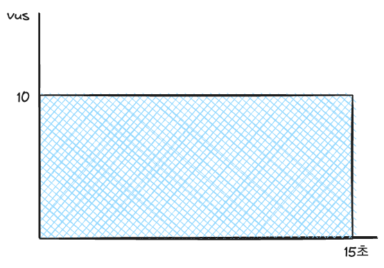

# k6 가이드

## 1. k6 설치하기

https://k6.io/docs/get-started/installation

> [!NOTE]
>
> 아래부터는 `practices/inventory/load_test/k6` 기준으로 스크립트를 실행합니다.
>

## 2. k6 새로운 스크립트 만들기

```shell
k6 new sample.js
```

## 3. k6 스크립트 실행하기

```shell
k6 run sample.js
```

## 4. k6 결과 확인하기

```
     data_received..................: 1.5 MB 92 kB/s
     data_sent......................: 16 kB  968 B/s
     http_req_blocked...............: avg=35.42ms  min=1µs      med=9µs      max=450.01ms p(90)=14µs     p(95)=439.83ms
     http_req_connecting............: avg=525.12µs min=0s       med=0s       max=11.11ms  p(90)=0s       p(95)=4.91ms  
     http_req_duration..............: avg=214.15ms min=195.02ms med=203.47ms max=411.08ms p(90)=211.73ms p(95)=355.3ms 
       { expected_response:true }...: avg=214.15ms min=195.02ms med=203.47ms max=411.08ms p(90)=211.73ms p(95)=355.3ms 
     http_req_failed................: 0.00%  ✓ 0        ✗ 125 
     http_req_receiving.............: avg=11.07ms  min=31µs     med=132µs    max=202.76ms p(90)=315.6µs  p(95)=153.71ms
     http_req_sending...............: avg=37.59µs  min=6µs      med=34µs     max=405µs    p(90)=56.8µs   p(95)=66.79µs 
     http_req_tls_handshaking.......: avg=33.31ms  min=0s       med=0s       max=424.3ms  p(90)=0s       p(95)=413.61ms
     http_req_waiting...............: avg=203.03ms min=194.84ms med=202.15ms max=213.34ms p(90)=210.48ms p(95)=211.27ms
     http_reqs......................: 125    7.710633/s
     iteration_duration.............: avg=1.25s    min=1.19s    med=1.2s     max=1.66s    p(90)=1.39s    p(95)=1.64s   
     iterations.....................: 125    7.710633/s
     vus............................: 5      min=5      max=10
     vus_max........................: 10     min=10     max=10


```

**http_reqs**: 전체 요청 수 (위에서는 125번)
**http_req_failed**: 전체 실패 수와 퍼센티지 (위에서는 0.00%, 0번)
**http_req_duration**: 요청을 받는데 걸린 시간. `http_req_sending` + `http_req_waiting` + `http_req_receiving`
**iterations**: 전체 반복 수 (위에서는 125번)
**vus**: 요청을 보낸 가상 사용자 수 (위에서는 5명)

## 5. 요청 수 설정하기

### 고정된 virtual user로 요청 보내기

```js
export const options = {
  // A number specifying the number of VUs to run concurrently.
  vus: 10,
  // A string specifying the total duration of the test run.
  duration: '15s',
```



vus * 15(duration) * rps(초당 요청 수) = 전체 요청 수

```js
sleep(1); // 1 rps와 비슷
sleep(0.25) // 4 rps와 비슷
```

### ramping-vus로 점진적으로 요청 늘리기

```js
export const options = {
  scenarios: {
    getStock: {
      executor: 'ramping-vus',
      startVUs: 0,
      stages: [
        {duration: '5s', target: maxVus},
        {duration: '10s', target: maxVus},
        {duration: '5s', target: 0},
      ],
```


(maxVus * 5 / 2 + maxVus * 10 + maxVus * 5 / 2) * rps = 전체 요청 수
15 * maxVus * rps = 전체 요청 수

참고: https://k6.io/docs/using-k6/metrics/reference