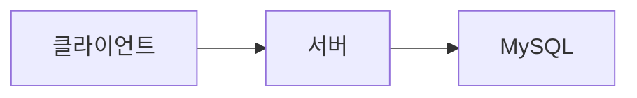
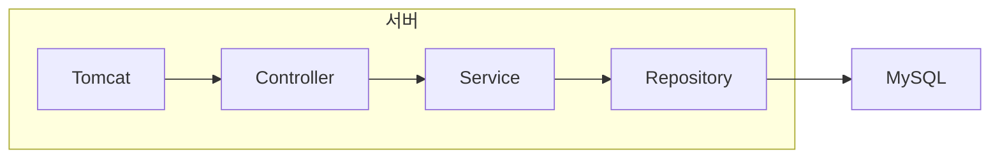

# 재고 서비스 tech spec

## 요약
재고의 조회, 차감, 수정 등을 제공하는 서비스를 구현합니다.

## 목표
- 특정 상품의 재고를 조회할 수 있습니다.
- 특정 상품의 재고를 차감할 수 있습니다.
  - 동시에 여러 요청이 들어와도 순차적으로 재고를 차감하여 데이터 무결성을 제공합니다.
- 특정 상품의 재고를 수정할 수 있습니다.
  - 동시에 여러 요청이 들어와도 순차적으로 재고를 수정하여 데이터 무결성을 제공합니다.

## 아키텍쳐
### 시스템 아키텍쳐
- 클라이언트에서 rest api를 통해서 서버에 요청을 전달합니다.
- 서버는 MySQL에서 정보를 조회, 변경하고 비즈니스 로직을 수행하여 응답을 생성합니다.
- 서버는 응답을 클라이언트에 전달합니다.

### 서버 아키텍쳐
- Spring MVC 기반의 레이어드 아키텍쳐로 구성합니다.
- 내장 tomcat을 사용해서 클라이언트의 요청을 수신하고 응답을 반환합니다.
- Spring JPA를 이용해서 MySQL에 db 쿼리 요청을 전달하고 결과를 객체로 변환합니다.

## 기술 스택
기술 스택은 코드를 작성하는 시점(2024년 3월) 기준 모두 최신 버전을 적용했습니다.

spring dependency management plugin을 사용해서 버전을 관리합니다.

- 어플리케이션
  - Spring boot 3.2.4
    - Spring actuator
    - Spring webmvc
  - Spring data 2023.1.3
    - Spring data jpa
    - MySQL 8.3
- 개발 환경
  - Java 21
  - Gradle 8.6
  - refreshVersions gradle plugin 0.60.5
  - SonarQube gradle plugin 4.4.1.3373
  - IntelliJ IDEA 2023.3.5 (Ultimate Edition)
- 테스트
  - JUnit 5.10.2
  - Mockito 5.11.0
  - Testcontainers 1.19.7

## 참고
- [재고 서비스 prd v1](../prd/재고서비스_prd_v1.md)
